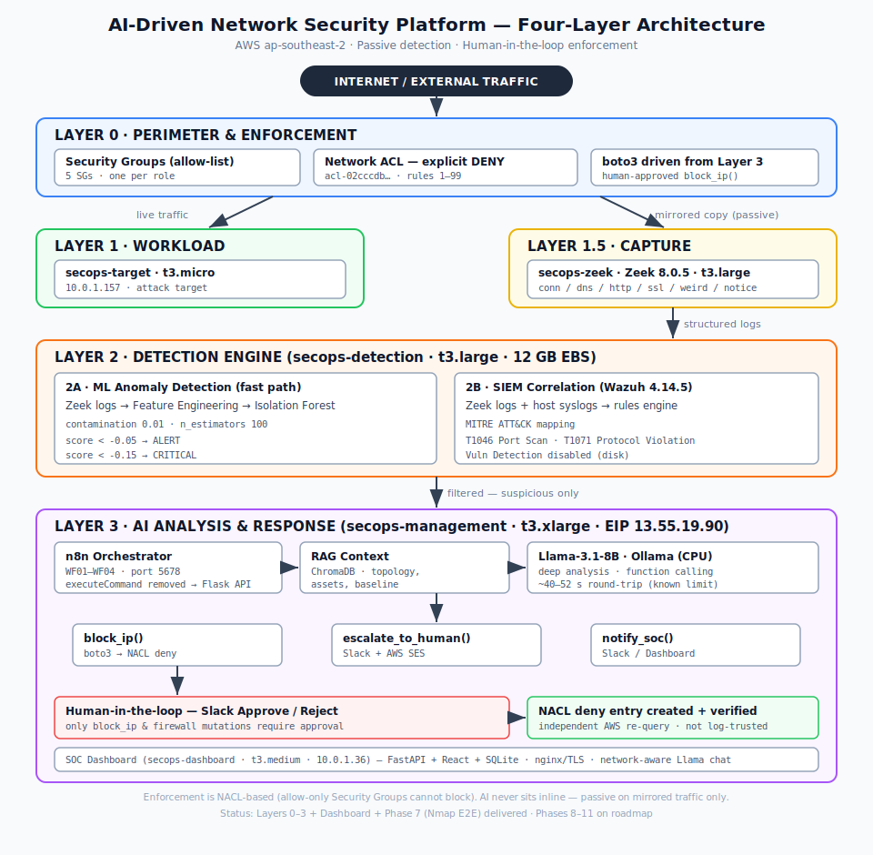

<!-- Banner: replace with an exported PNG of full-architecture.svg or a demo GIF -->
<p align="center">
  
</p>

<h1 align="center">AI-Driven Network Security Platform on AWS</h1>

<p align="center">
  <b>Passive traffic capture · ML anomaly detection · SIEM correlation · LLM triage · Human-in-the-loop enforcement</b><br>
  <sub>Zeek · Isolation Forest · Wazuh · Llama-3.1-8B (Ollama) · ChromaDB/RAG · n8n · Terraform · AWS</sub>
</p>

<p align="center">
  
  
  
  
  
  
</p>

---

## TL;DR

A four-layer, **passive** SOC platform on AWS. Mirrored traffic is parsed by Zeek, scored by an Isolation Forest engine, correlated by Wazuh against MITRE ATT&CK, triaged by a local LLM with RAG context, and — only after a human approves in Slack — an attacker IP is blocked via an **AWS Network ACL explicit deny**, then independently verified by re-querying AWS.

The AI never sits inline in the live traffic path. A failure or compromise of the detection/AI stack cannot affect production connectivity.

> **Honesty note.** Layers 0–3, the SOC Dashboard, and **Phase 7 (Nmap end-to-end demo)** are built and verified. **Phases 8–11 are on the roadmap** with full technical implementation plans in [`docs/roadmap-phase-8-11.md`](docs/roadmap-phase-8-11.md). Every claim below reflects what actually runs; roadmap items are labelled as such.

---

## Demo

> 📹 **[Phase 7 — Nmap → NACL block, end-to-end](#)** — _YouTube link to be added_

<!-- Optional: short GIF at the top of the demo, full walkthrough on YouTube -->

The recorded run shows: attacker nmap → Zeek capture → ML CRITICAL alert → Wazuh T1046 → n8n triage → Llama analysis → Slack approval → NACL deny entry created and confirmed by direct AWS query.

---

## Architecture

<p align="center">
  
</p>

| Layer | Component | Function |
|-------|-----------|----------|
| **0 · Perimeter** | Security Groups + **Network ACL** | Allow-list at the edge; explicit **deny** for blocked IPs (rules 1–99) |
| **1 · Workload** | `secops-target` | Attack target |
| **1.5 · Capture** | **Zeek 8.0.5** (`secops-zeek`) | Mirrored packets → structured logs (conn/dns/http/ssl/weird/notice) |
| **2A · ML** | **Isolation Forest** (`secops-detection`) | Fast anomaly scoring; forwards only the anomalous fraction |
| **2B · SIEM** | **Wazuh 4.14.5** | Rule correlation + MITRE ATT&CK mapping |
| **3 · AI/Response** | **Llama-3.1-8B** + ChromaDB + **n8n** (`secops-management`) | LLM triage, RAG context, workflow orchestration, enforcement |
| **UI** | FastAPI + React + SQLite (`secops-dashboard`) | Live alerts + network-aware LLM chat |

**Traffic flow** (live vs. passive mirror): [`traffic-flow.svg`](architecture/diagrams/traffic-flow.svg)
**AWS topology** (VPC/subnet/EC2/NACL): [`aws-topology.svg`](architecture/diagrams/aws-topology.svg)
**Phase 7 E2E flow**: [`phase7-e2e-flow.svg`](architecture/diagrams/phase7-e2e-flow.svg)

---

## Key engineering decisions

**Enforcement is NACL-based, not Security Group.** AWS Security Groups are allow-only — every rule is OR'd, so adding one can only *widen* access. Blocking an attacker via `authorize_ingress` would open a backdoor. Enforcement therefore uses **NACL explicit deny** (rule numbers 1–99, below the default allow-all), and every block is confirmed by an independent AWS re-query — the audit log is never trusted as ground truth. → [`ADR-010`](architecture/decisions/adr-010-nacl-enforcement.md)

**AI is passive.** Detection runs entirely on the mirrored copy (VPC Traffic Mirroring, VXLAN UDP 4789). → [`ADR-002`](architecture/decisions/adr-002-passive-ai.md)

**Internal-IP guard.** Any source in `10.0.0.0/16` is excluded from both detection and enforcement, so the platform can never block its own infrastructure. Trade-off: currently blind to intra-VPC lateral movement. → [`ADR-011`](architecture/decisions/adr-011-internal-ip-guard.md)

**Single auth model.** All AWS actions (NACL, SES) go through one IAM-Role/boto3 primitive (Flask enforcement API, loopback). **No AWS credentials live inside n8n.** → [`ADR-009`](architecture/decisions/adr-009-iam-boto3-primitive.md)

**Lightweight ML before the LLM.** An 8B model on CPU costs tens of seconds per call. Isolation Forest scores thousands of connections/sec and passes on only the suspicious ones.

---

## Detection pipeline

```
Zeek conn.log → feature engineering (10s window per src IP) → Isolation Forest
     score < -0.05 → ALERT     score < -0.15 → CRITICAL
```

Features: `unique_dst_ports, unique_dst_ips, failed_conn_rate, bytes_out_ratio, conn_per_second, packet_to_byte_ratio, conn_state_encoded, duration, orig_bytes, orig_pkts`

| MITRE | ID | Signal |
|-------|-----|--------|
| Network Scanning | T1046 | `unique_dst_ports > 15` / 10s |
| Brute Force | T1110 | `failed_auth_rate > 50%` |
| DNS Tunneling | T1071.004 | `query_entropy > 3.5` |
| Data Exfiltration | T1041 | `bytes_out_ratio > 10` |
| Lateral Movement | T1021 | `unique_dst_ips > 5` from one host |

---

## Enforcement chain (human-in-the-loop)

```
Alert → n8n WF01 (sanitize → RAG → Llama) → WF02 (Slack Approve/Reject)
      → admin approves → WF04 → WF03 → block_ip() → NACL deny → verify via AWS query
      → timeout → policy-driven auto-escalation (AEST business-hours aware)
```

Escalation policy: CRITICAL 30 min · HIGH 60/30 min · MEDIUM 120/60 min (email only) · LOW log only.

---

## Repository structure

```
├── architecture/
│   ├── architecture-overview.md          # as-built reference
│   ├── diagrams/*.svg                     # the 4 diagrams above
│   └── decisions/adr-*.md                 # ADR-002/004/009/010/011/012
├── infrastructure/terraform/             # VPC, subnets, SGs, EC2, NACL (state imported)
├── layer1-capture/                       # Zeek config + setup
├── layer2-detection/
│   ├── ml-engine/                        # feature_engineering, train_model, live_detection
│   └── wazuh/                            # custom_rules.xml, ossec.conf
├── layer3-ai/agent/                      # firewall_actions, enforcement_api, sanitizer
├── orchestration/workflows/              # n8n WF01–WF04 (tokens via n8n Credential)
├── dashboard/                            # FastAPI backend + React frontend
├── security-hardening/                   # disk-guard.sh, roadmap items
├── docs/roadmap-phase-8-11.md            # detailed Phase 8–11 implementation plans
└── evidence/                             # screenshots, logs, results.md (KPIs)
```

---

## Roadmap & status

| Phase | Scope | Status |
|-------|-------|--------|
| 0–1 | AWS + Terraform (VPC, SGs, EC2, NACL) | ✅ Delivered |
| 2 | Zeek + VPC Traffic Mirroring | ✅ Delivered |
| 3 | Isolation Forest ML engine | ✅ Delivered |
| 4 | Wazuh SIEM + MITRE mapping | ✅ Delivered |
| 5 | Llama-3.1-8B + ChromaDB/RAG | ✅ Delivered |
| 6 | n8n orchestration (E2E Approve path AWS-verified) | ✅ Delivered |
| — | SOC Dashboard (network-aware chat) | ✅ Delivered |
| **7** | **Nmap demo — end-to-end, recorded** | ✅ **Delivered** |
| 8 | SQL Injection demo — ALB + TLS + DVWA + L7 parser | 🔲 Roadmap |
| 9 | Egress monitoring — FFT beaconing detection | 🔲 Roadmap |
| 10 | Hardening — prompt-injection, IAM scope-down, WAF migration | 🔲 Roadmap |
| 11 | Red team + KPI measurement | 🔲 Roadmap |
| 12 | Documentation & public release | 🔄 In progress |

---

## Known limitations (documented honestly)

- **LLM latency ~40–52 s on CPU** vs. the `<10 s` KPI target — the target requires the GPU (vLLM) serving path, documented as the production option. Measured on t3.xlarge.
- **`live_detection.py` is stateless** — re-reads the full `conn.log` each poll with in-memory cooldown; duplicate alerts after restart. Fix (byte-offset + persistent cooldown) is the top pre-Phase-8 item.
- **NACL caps at ~99 concurrent blocks** and applies at subnet granularity — fine for a single-attacker demo; AWS WAF IP-set is the production path (Phase 10).
- **`secops-ai-role` holds `AmazonEC2FullAccess`** — to be scoped down in Phase 10.
- **Internal `/16` fully excluded** from detection — blind to intra-VPC lateral movement by design (external-attacker scope).

---

## Tech stack

`Terraform` · `Zeek 8.0.5` · `scikit-learn (Isolation Forest)` · `Wazuh 4.14.5` · `Ollama + Llama-3.1-8B` · `ChromaDB` · `n8n 2.8` · `Flask + boto3` · `FastAPI + React + SQLite` · `nginx/TLS` · `Slack` · `AWS SES` · AWS: `VPC · Traffic Mirroring · NACL · EC2 · IAM · SES · CloudWatch`

---

<sub>Portfolio project. All infrastructure IDs shown are from a disposable lab account. No credentials are committed — see <code>.gitignore</code>.</sub>
